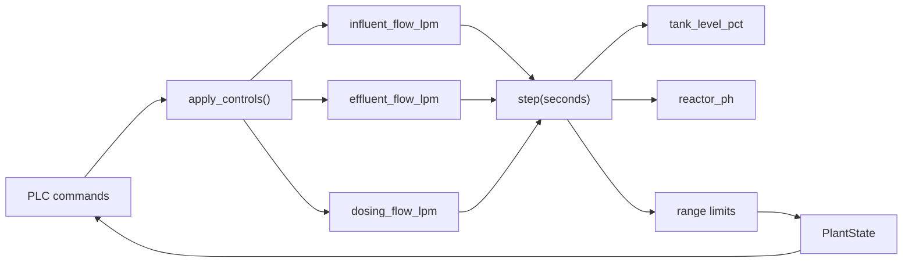
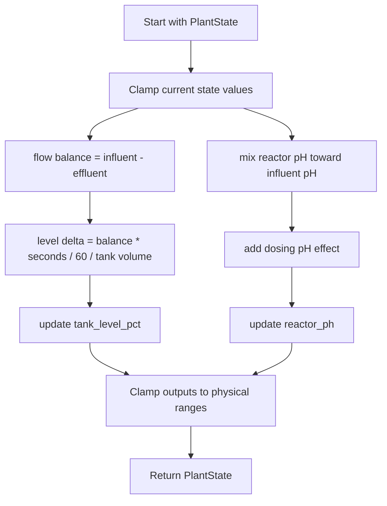
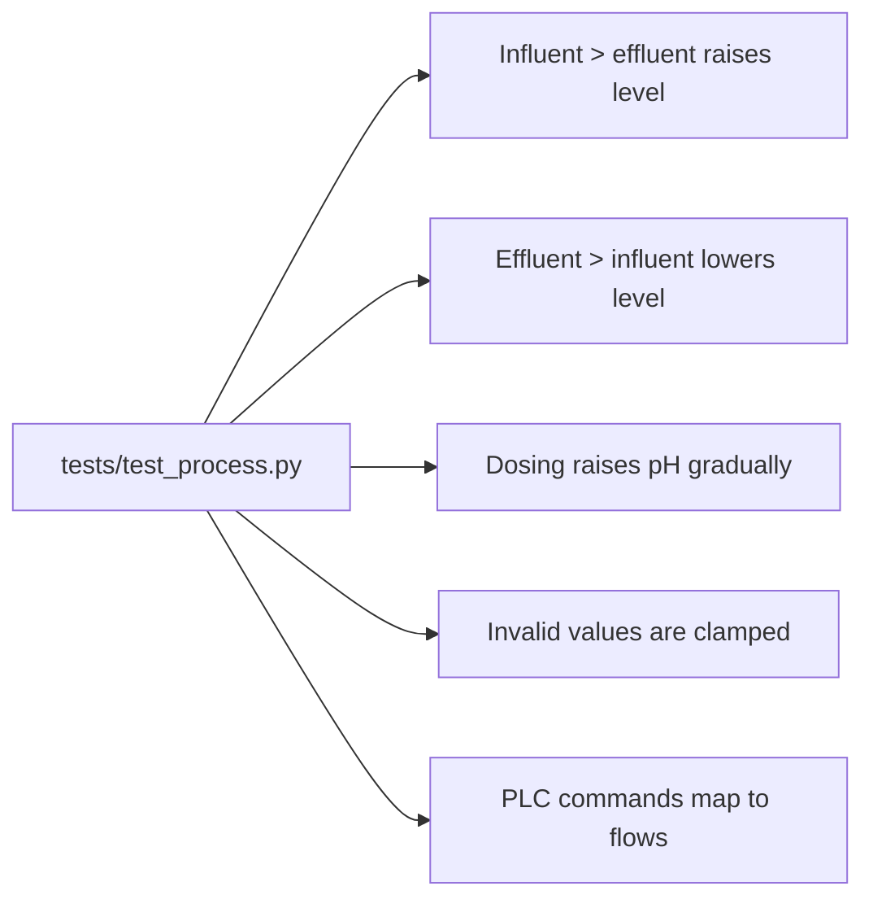

# Process Simulator

This page visualizes the Step 2 process simulator implementation.

## Process Model

## State Update Logic

## Key Ranges

| Value | Range | Why it matters |
| --- | --- | --- |
| `tank_level_pct` | 0 to 100% | Prevents impossible tank levels. |
| `reactor_ph` | 0 to 14 | Keeps pH in a valid physical range. |
| `influent_flow_lpm` | 0 to configured max | Simulates inlet pump capacity. |
| `effluent_flow_lpm` | 0 to configured max | Simulates outlet valve capacity. |
| `dosing_flow_lpm` | 0 to configured max | Simulates dosing pump capacity. |

## Test Coverage

